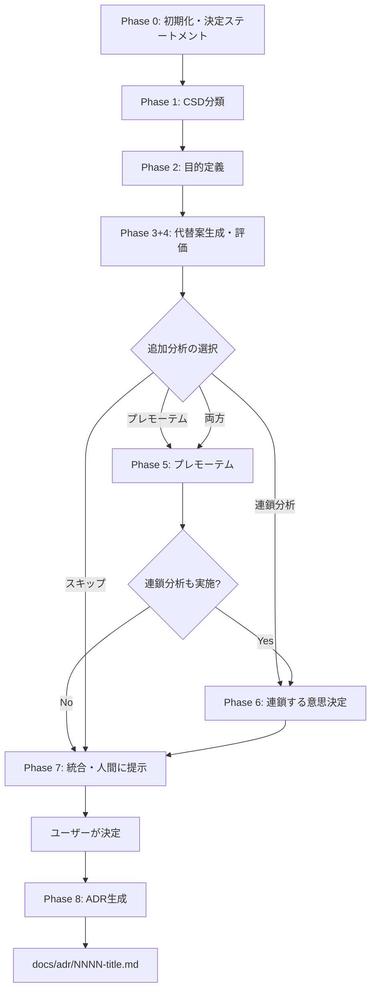

# adr_create

技術選定・アーキテクチャ設計・開発方針策定など、トレードオフを伴う意思決定において、PrOACTフレームワークに基づく構造化された審議プロセスを実行し、ADR（Architecture Decision Record）を生成するスキル。ユーザーが議題を提供すると、制約の確度分類、目的の定義、目的別の並列評価を経てトレードオフを体系化し、必要に応じてプレモーテム分析・連鎖分析を追加した上で、ユーザーの最終決定を含むADRを `docs/adr/` に出力する。

## 使い方

```
/adr_create
```

引数なし。対話形式で議題を収集する。

## 処理フロー


```mermaid
flowchart TD
    P0[Phase 0: 初期化・決定ステートメント] --> P1[Phase 1: CSD分類]
    P1 --> P2[Phase 2: 目的定義]
    P2 --> P34[Phase 3+4: 代替案生成・評価]
    P34 --> AnalysisChoice{追加分析の選択}
    AnalysisChoice -->|プレモーテム| P5[Phase 5: プレモーテム]
    AnalysisChoice -->|連鎖分析| P6[Phase 6: 連鎖する意思決定]
    AnalysisChoice -->|両方| P5
    P5 --> P6Check{連鎖分析も実施?}
    P6Check -->|Yes| P6
    P6Check -->|No| P7
    AnalysisChoice -->|スキップ| P7
    P6 --> P7[Phase 7: 統合・人間に提示]
    P7 --> Decision[ユーザーが決定]
    Decision --> P8[Phase 8: ADR生成]
    P8 --> ADR[docs/adr/NNNN-title.md]
```

### 各フェーズの概要

| Phase | 名称 | 処理概要 |
|-------|------|---------|
| 0 | 初期化 | 議題収集、決定ステートメント策定、リサーチ、既存ADR参照 |
| 1 | CSD分類 | 制約の収集・確度分類 + レッドチーム検証 |
| 2 | 目的定義 | 根本目的の定義（最大5件） |
| 3+4 | 代替案生成・評価 | 目的別エージェントが並列で代替案提案+評価 |
| — | 追加分析の選択 | プレモーテム・連鎖分析の実行有無を推奨理由とともに確認 |
| 5 | プレモーテム | 有力選択肢の失敗シナリオ生成（任意） |
| 6 | 連鎖する意思決定 | 将来の意思決定への影響分析（任意） |
| 7 | 統合・提示 | 審議サマリー生成 + ユーザーの決定収集 |
| 8 | ADR生成 | 審議結果+決定をADR形式で出力 |

## 入力仕様

| 入力 | Phase | 形式 | 必須 |
|------|-------|------|------|
| 議題 | 0 | 自然言語テキスト | 必須 |
| 決定ステートメント確認 | 0 | 承認/修正 | 必須 |
| CSD分類確認 | 1 | 承認/修正 | 必須 |
| 目的定義確認 | 2 | 承認/修正 | 必須 |
| 代替案確認 | 3+4 | 承認/追加/削除 | 必須 |
| 追加分析の選択 | 3+4後 | 選択肢から選択 | 必須 |
| 採用する選択肢 | 7 | 選択肢リストから選択 | 必須 |
| 根拠・トレードオフ | 7 | 自然言語テキスト | 必須 |

## 出力仕様

### ADR

`docs/adr/NNNN-<title-slug>.md` に出力。ファイル命名規則:
- `NNNN`: 4桁ゼロ埋め連番（0001起番）
- `<title-slug>`: 英語kebab-case（50文字以内）

ADRの主要セクション: ステータス、コンテキスト、前提条件（CSD）、判断基準、検討した選択肢、トレードオフ分析、リスク分析（プレモーテム実施時）、将来影響（連鎖分析実施時）、決定、根拠、受け入れたトレードオフ

### 中間ファイル

`.skill_output/adr_create/{topic_slug}/` に永続保存:

| ファイル | Phase | 条件 | 内容 |
|----------|-------|------|------|
| decision-statement.md | 0 | 常時 | 決定ステートメント、スコープ、可逆性 |
| research.md | 0 | 常時 | リサーチ結果 |
| prior-decisions.md | 0 | 既存ADRがある場合 | 関連する既存決定 |
| csd-draft.md | 1 | 常時 | CSD初期分類 |
| csd-challenges.md | 1 | 常時 | レッドチームの指摘 |
| csd-final.md | 1 | 常時 | 確定CSD分類 |
| objectives.md | 2 | 常時 | 判断基準（根本目的） |
| eval-obj-{N}.md | 3+4 | 常時 | 各目的別の評価結果 |
| alternatives.md | 3+4 | 常時 | 統合済み代替案一覧 |
| evaluation-matrix.md | 3+4 | 常時 | トレードオフ行列 |
| premortem.md | 5 | プレモーテム実施時 | プレモーテム分析 |
| linked-decisions.md | 6 | 連鎖分析実施時 | 連鎖する意思決定 |
| deliberation-summary.md | 7 | 常時 | 審議サマリー |

## 追加分析の推奨基準

Phase 3+4 完了後に、以下の基準に基づいて推奨を提示する:

### プレモーテム分析（Phase 5）

| 推奨トリガー | データソース |
|------------|-------------|
| 可逆性が high | decision-statement.md |
| 不確実（Doubt）が 3件以上 | csd-final.md |
| 上位2案の評価が僅差 | evaluation-matrix.md |

### 連鎖分析（Phase 6）

| 推奨トリガー | データソース |
|------------|-------------|
| 可逆性が high | decision-statement.md |
| 基盤的な決定（後続の決定を制約） | decision-statement.md |
| 関連する既存ADRが存在 | prior-decisions.md |

## エージェント構成

| エージェント | Phase | 数 | 役割 |
|---|---|---|---|
| リサーチャー | 0 | 1 | 最新情報の調査 |
| ファシリテーター | 1前半, 2, 7 | 各1 | 制約収集、目的定義、統合 |
| レッドチーム | 1後半 | 1 | CSD分類の批判的検証 |
| 目的別評価 | 3+4 | 目的数（最大5） | 代替案生成・評価（並列実行） |
| プレモーテム | 5 | 1 | 失敗シナリオ生成 |
| 将来分析 | 6 | 1 | 連鎖する意思決定の分析 |
| ADR生成 | 8 | 1 | ADR文書の生成 |

全エージェントは Task ツールで起動する（エージェント間通信不要のため TeamCreate は不使用）。
Phase 3+4 の目的別評価エージェントは1メッセージで並列起動し、各エージェントは他のエージェントの出力を見ない（情報遮断による独立評価）。

## 制約と限界

### このスキルが有効な場面

- 複数の選択肢があり、各々にトレードオフがある技術的意思決定
- 判断基準が複数あり、単一の基準では決められない場面
- 決定の影響が中〜長期に及ぶ場面

### このスキルが不適切な場面

- 正解が1つに定まる問題（バグ修正、仕様の確認等）
- 制約によって選択肢が1つに絞られる場面
- 極めて短期的・軽微な判断

### 既知の限界

- 議論の質はLLMの知識に制限される
- LLMの訓練データに含まれない最新技術については評価精度が低下する
- 独立評価の統合であり、人間の議論で起きる「創発的なアイデア」が生まれにくい

## 理論的背景

このセクションはスキル改修時に設計判断の根拠を把握するための参照情報。各設計判断を変更する際は、その根拠となっている理論との整合性を確認すること。

### 全体構造: PrOACT フレームワーク

本スキルの全体構造は Hammond, Keeney, Raiffa による PrOACT（Problem, Objectives, Alternatives, Consequences, Tradeoffs）フレームワークに基づく。PrOACT は「目的（Values）に焦点を当てた」アプローチであり、代替案ではなく目的から出発する。LLM は具体的な選択肢を与えられるとアンカリングされやすいため、先に目的を定義して評価の枠組みを確立する構造が特に重要である。

PrOACT からの主な逸脱:
- **CSD分類（Phase 1）を Objectives（Phase 2）より前に配置**: AIが不確実な前提を確実として扱う傾向への対策。議論の冒頭で前提の確度を可視化する
- **Risk Tolerance を意図的に除外**: リスク許容度は人間の価値判断であり、「人間が最終判断する」原則に従いAIには委譲しない

| PrOACT要素 | 対応Phase | 備考 |
|---|---|---|
| Problem | Phase 0 | 議題の明確化 |
| Uncertainty | Phase 1 | CSD行列で構造化（前置き） |
| Objectives | Phase 2 | 手段目的→根本目的の分離を含む |
| Alternatives | Phase 3 | 目的駆動型の生成 |
| Consequences | Phase 4 | 独立並列評価 |
| Tradeoffs | Phase 7 | 統合・判断ガイド |
| Linked Decisions | Phase 6 | 将来の選択肢への影響 |
| Risk Tolerance | 人間に委ねる | Phase 7 の判断ガイドで条件付き提示のみ |

### 目的先行の評価設計

Keeney の Value-Focused Thinking（1992）に基づき、「何を達成したいか」から出発する。手段目的（「JWTを使いたい」）と根本目的（「ステートレスにスケールしたい」）の分離は、LLM の生成バイアス（頻出技術名へのアンカリング）への対策として機能する。Phase 2 で定義された目的がそのまま Phase 3+4 のエージェント構成を決定する仕組みにより、目的の定義が議論の構造を自動的に決定する。

### 不確実性管理: CSD分類

CSD行列（Certainties, Suppositions, Doubts）は認識論的不確実性の実用的な表現形式。主な効果:
1. Supposition は Phase 5 プレモーテムの「この仮定が崩れたら？」の起点になる
2. 議論の結論に「この結論は以下の仮定に依存する」という注記を自動生成する基盤になる
3. レッドチームによる検証ステップが、LLM が前提を無批判に受け入れる傾向に対抗する

### プレモーテム分析

Gary Klein（2007, Harvard Business Review）が発表した手法。認知心理学の「前向きの後知恵（prospective hindsight）」に基づき、「確実に失敗した」前提で考えることで通常のリスク評価より具体的な失敗シナリオを生成する。LLM のナラティブ生成能力との親和性が高く、CSD の Supposition/Doubt と組み合わせることで構造化されたリスク分析になる。確証バイアス（Phase 4 で有力に見える選択肢を強化し続ける傾向）への対抗手段。

### エージェント設計: 探求的マインドセットと情報遮断

SDM（Structured Decision Making）文献の「探求的（inquiry）マインドセット」に基づき、各エージェントは「擁護」ではなく「評価」を行う。MAD（Multi-Agent Debate）研究からの知見:
- 多数派収束は主要な課題であり、情報遮断（各エージェントが他の出力を見ない独立評価）で構造的に防止する
- 同質なエージェントでも異なる目的に焦点を当てることで構造的な異質性を確保できる
- 反復的な議論（複数ラウンド応酬）ではなく独立評価の構造的統合を採用（多数派収束リスク排除、コスト予測可能性）

### 出力設計: 推奨を示さない原則

SDM の「価値判断と科学的分析の分離」原則に基づく。「{目的}を最優先するなら→{選択肢}」の条件付き提示のみ行い、優先順位の決定は人間に委ねる。定性評価（◎/○/△/×）は PrOACT の「自然単位原則」に従い、数値スコアの偽の精密性と加重合計による安易な選択を防止する。

### 連鎖する意思決定

PrOACT の拡張要素 Linked Decisions の実装。「この決定によって、将来のどの意思決定の選択肢が狭まるか、または広がるか？」という問いに焦点を当てる。ソフトウェアにおける技術的負債の多くは、過去の決定が将来の選択肢を狭めた結果であり、この分析は特に不可逆性の高い決定で重要。

### 適応的な追加分析

PrOACT は「決定の複雑さに応じて各ステップを素早くまたはゆっくり行うことができる」と述べている。追加分析（プレモーテム・連鎖分析）の実行有無選択はこの原則の実装であり、収集済みデータに基づく推奨基準を提示することで、ユーザーが適切な分析深度を選択できるようにしている。
