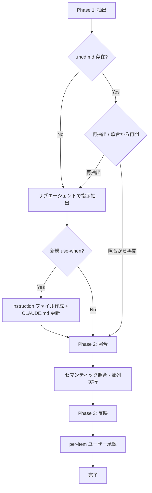

# instruction_extract

調査や実験で得た知見を `docs/knowledge/` に自由に書き出し、このスキルで `.claude/instructions/` の構造化 instruction に反映する。入力ファイルから AI の行動改善に繋がる指示を抽出し、既存 instruction との重複・矛盾をセマンティック照合で検知しながら、ユーザー主導で情報を整理する。

## 使い方

```
/instruction_extract <source_path>
```

- `source_path`: `docs/knowledge/` 配下のマークダウンファイル

## 処理フロー



### 各フェーズの概要

| Phase | 名称 | 処理概要 |
|-------|------|---------|
| 1 | 抽出 | 入力ファイルから指示を抽出し .med.md 生成。新規 use-when があれば即時解決 |
| 2 | 照合 | .med.md 項目と既存 instruction をセマンティック照合し判定テーブル生成 |
| 3 | 反映 | 判定結果に基づき per-item でユーザー承認しながら instruction 更新 |

## 入力仕様

| 入力 | Phase | 形式 | 必須 |
|------|-------|------|------|
| source_path | 1 | `docs/knowledge/*.md` のファイルパス | 必須 |
| 新規 use-when の承認 | 1 | 承認/修正/キャンセル | 新規 use-when がある場合 |
| 各項目の承認 | 3 | 承認/修正/スキップ | 各項目ごと |
| 矛盾の解決方針 | 3 | 4つの選択肢から選択 | 矛盾がある場合 |

## 出力仕様

### 中間ファイル

`docs/knowledge/{basename}.med.md` に出力。処理済みマーカーとして機能する。

```markdown
# Instruction Extract: {basename}

source: docs/knowledge/{basename}.md
extracted: {YYYY-MM-DD}
items: {N}

---

## KE-001: {短いタイトル}

- **use-when**: {CLAUDE.md テーブルの use-when テキスト}
- **scope**: {適用される状況}
- **action**: {AIが取るべき行動}
- **rationale**: {根拠}
- **conditions**: {逆転条件。なければ省略}
```

### instruction ファイル

`.claude/instructions/*.md` に追記。.med.md と統一した構造化フィールド形式。

```markdown
## {指示タイトル}

- **scope**: {適用される状況}
- **action**: {AIが取るべき行動}
- **rationale**: {根拠}
- **conditions**: {逆転条件。なければ省略}
- **source**: docs/knowledge/{basename}.md
```

### CLAUDE.md

新規 instruction ファイル作成時に Instructions and Knowledge テーブルに行を追加。

## 照合の判定分類

| 判定 | 意味 | スキルの動作 |
|------|------|------------|
| new | 既存に該当なし | instruction に追記 |
| duplicate | 実質的に同じ情報が存在 | 追記しない。docs/knowledge/ 側を整理 |
| contradiction | 同じ状況に対し逆の推奨 | 追記しない。ユーザー判断で解決 |
| conditional | 条件が異なるため共存可能 | 条件付きバリエーションとして追記 |
| strengthening | 既存に新たなデータを追加 | 既存項目の根拠を補強更新 |

照合はアンカーマッチング（構造的な要素同士の照合）ではなく、LLM のセマンティック解釈で行う。.med.md の構造化フィールドは比較精度を上げる入力として機能し、出力のみ構造化テーブルで制約する。

## エージェント構成

| エージェント | Phase | 数 | 役割 |
|---|---|---|---|
| 抽出 | 1 | 1 | 入力ファイルから指示を抽出し .med.md を生成 |
| 照合 | 2 | 対象ファイル数 | 各 instruction ファイルとのセマンティック照合（並列実行） |

全エージェントは Task ツールで起動する。Phase 2 の照合エージェントは対象ファイルごとに並列実行する。

## ファイル構成

```
.claude/skills/instruction_extract/
├── SKILL.md                      # スキル本体
├── README.md                     # このファイル
└── templates/
    ├── extraction.md             # 抽出サブエージェント用テンプレート
    └── comparison.md             # 照合サブエージェント用テンプレート
```

## 関連するスキル・ファイル

| ファイル | 関係 |
|---------|------|
| `/learn` スキル | 対話から知見を抽出する姉妹スキル。抽出フィルタ基準と記述原則を共有 |
| `docs/knowledge/*.md` | 入力ファイルの置き場所。自由形式で調査メモ・実験結果を記載 |
| `.claude/instructions/*.md` | 出力先。AI がタスク実行時に参照する構造化 instruction |
| `.claude/knowledge/*.md` | 手動管理。レビュー観点リスト等の参照知識 |
| `CLAUDE.md` | Instructions and Knowledge テーブルで use-when ↔ ファイルパスの対応を管理 |

## 設計判断の根拠

### セマンティック照合を採用した理由

prompt-engineering-findings.md の知見に基づく:
- 「まず問題を網羅的に検出させ、その後に報告フォーマットへ整形させる」→ 検出は自由に、出力は構造化
- アンカーマッチング（太字の主張同士の照合）は、同じ概念でも表現が大きく異なるケースを見逃す
- .med.md の構造化フィールド（scope, action, rationale, conditions）が LLM に「何を比較すべきか」を明示し、比較精度を上げる

### .med.md と instruction の統一フォーマット

- 中間ファイルと最終出力のフォーマットを統一することで、変換ロジックを単純化
- AI にとって「いつ→何を→なぜ→例外」が一目瞭然な構造
- 照合時にフィールド同士の比較がしやすい

### use-when の即時解決

- 新規 use-when を Phase 1 で即座にファイル作成 + CLAUDE.md 追記することで、.med.md 内の全項目が常に既存エントリへの参照になる
- Phase 2/3 で新規/既存の分岐処理が不要になり、フローが単純化
- 複数項目が同じ新規 use-when を持つ場合の表記揺れを防止

### source フィールドによる出自追跡

- instruction から元の調査メモへの参照を保持し、情報の陳腐化時に一括特定・削除を可能にする
- 根拠の詳細を確認したい場合に元ファイルを参照できる
