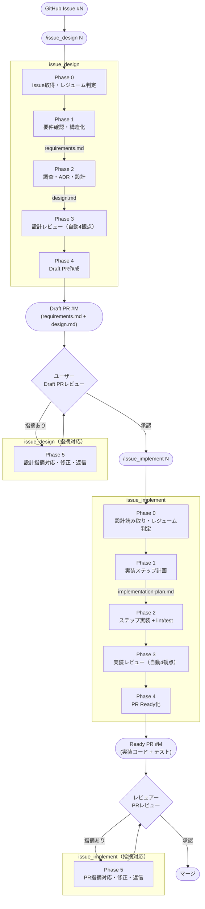
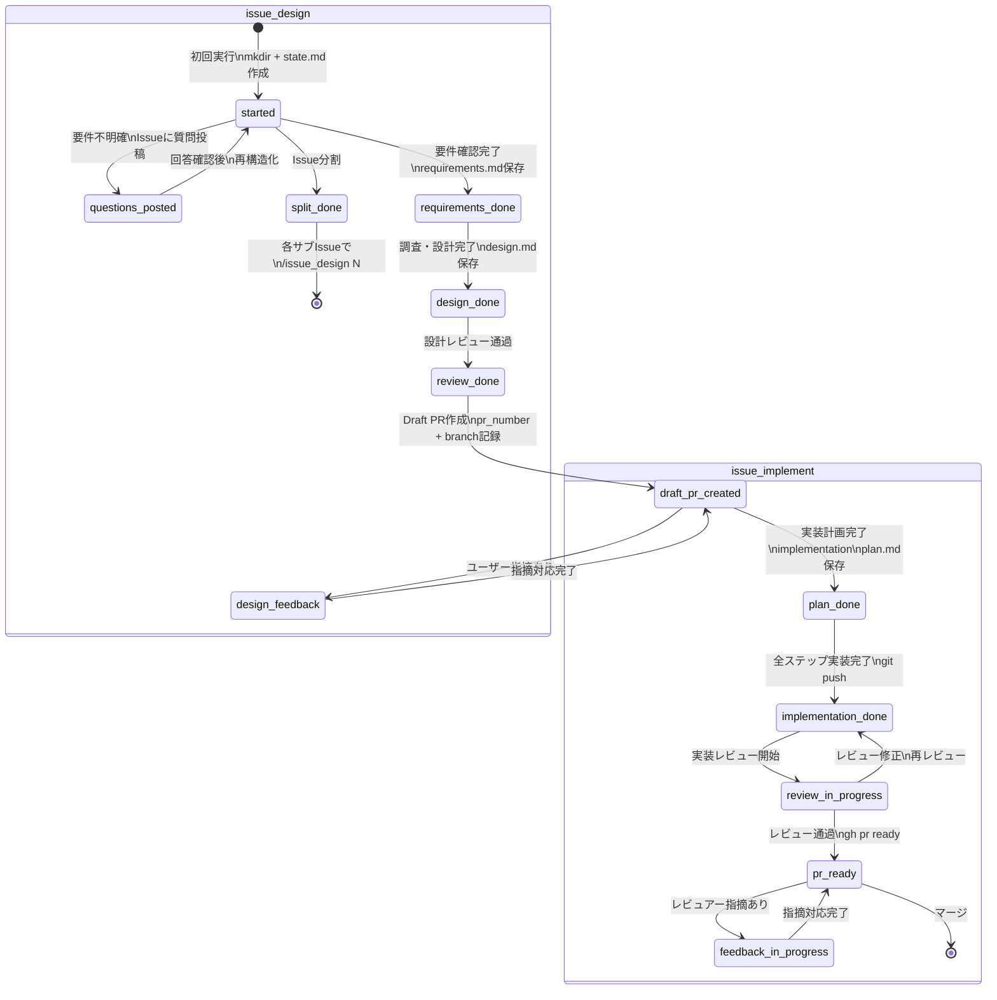
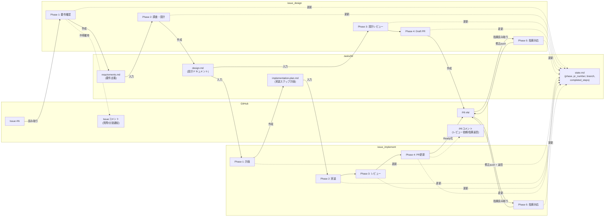
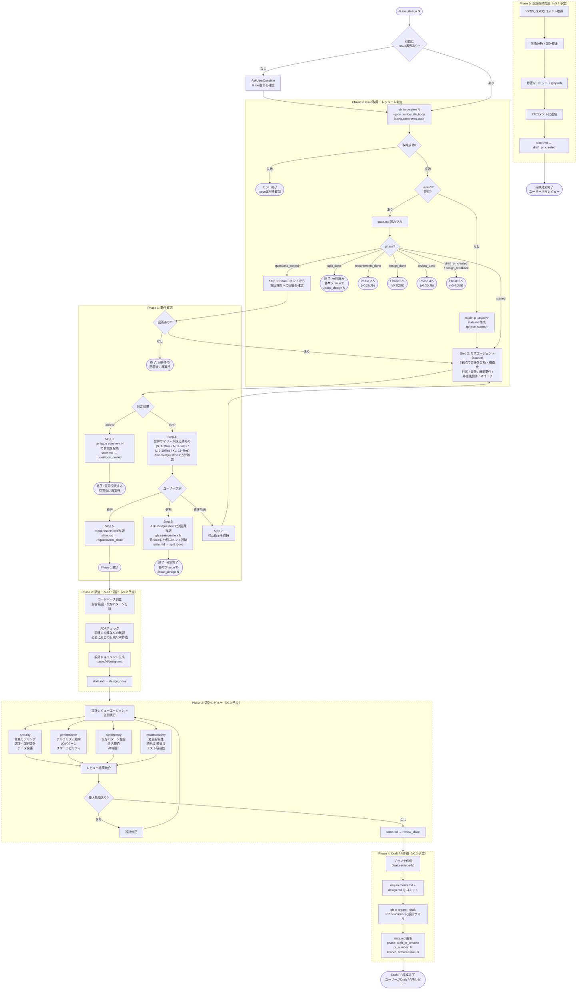
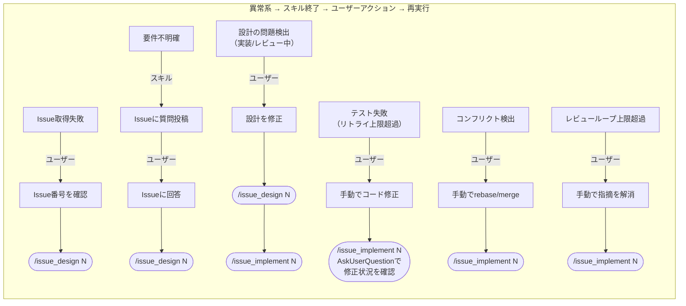

# issue_design / issue_implement 開発パイプライン

GitHub Issueを起点に、設計から実装・マージまでの全工程をスキルで自動化するパイプライン。

## 全体パイプライン



## 状態遷移図（state.md）

両スキルは `.tasks/N/state.md` の `phase` フィールドで進捗を管理し、中断・再開（レジューム）を実現する。



## データフロー（.tasks/N/）



## issue_design 詳細フロー



## issue_implement 詳細フロー

```mermaid
flowchart TD
    Start(["/issue_implement N"]) --> IP0_arg{引数に\nIssue番号あり?}
    IP0_arg -->|なし| IP0_ask["AskUserQuestion\nIssue番号を確認"]
    IP0_ask --> IP0
    IP0_arg -->|あり| IP0

    subgraph IP0["Phase 0: 設計読み取り・レジューム判定"]
        IP0_1[".tasks/N/state.md を読み取り"]
        IP0_2{state.mdに\npr_number あり?}
        IP0_1 --> IP0_2
        IP0_2 -->|なし| IP0_err(["エラー: issue_designが未完了\n/issue_design N を先に実行"])
        IP0_2 -->|あり| IP0_3["gh pr view でPR情報取得\nブランチをcheckout"]
        IP0_3 --> IP0_conflict["ベースブランチとの\nコンフリクトチェック"]
        IP0_conflict --> IP0_conflict_check{コンフリクト\nあり?}
        IP0_conflict_check -->|あり| IP0_conflict_err(["コンフリクトの詳細をログ出力\n手動でrebase/merge解決後に再実行"])
        IP0_conflict_check -->|なし| IP0_4[".tasks/N/design.md を読み取り"]
        IP0_4 --> IP0_5{design.md\n存在?}
        IP0_5 -->|なし| IP0_err2(["エラー: design.mdがありません\n/issue_design N を再実行"])
        IP0_5 -->|あり| IP0_6{state.mdの\nphase?}
        IP0_6 -->|draft_pr_created| IP0_out["Phase 1へ"]
        IP0_6 -->|plan_done| IP0_resume_check{completed_steps\nあり?}
        IP0_resume_check -->|なし| IP0_resume["Phase 2 Step 1から"]
        IP0_resume_check -->|あり| IP0_resume_ask["AskUserQuestionで\n次ステップの修正状況を確認"]
        IP0_resume_ask --> IP0_resume_r{修正済み?}
        IP0_resume_r -->|はい| IP0_resume_skip["completed_stepsに追加\n次ステップからPhase 2へ"]
        IP0_resume_r -->|いいえ| IP0_resume_retry["当該ステップから\nPhase 2へ"]
        IP0_6 -->|implementation_done\n/ review_in_progress| IP0_review["Phase 3へ"]
        IP0_6 -->|pr_ready\n/ feedback_in_progress| IP0_pr["PR未対応コメント\nを取得"]
        IP0_pr --> IP0_pr_check{未対応\n指摘あり?}
        IP0_pr_check -->|あり| IP0_feedback["Phase 5へ"]
        IP0_pr_check -->|なし| IP0_done(["完了\n次: PR #N をマージ"])
    end

    IP0_out --> IP1
    IP0_resume --> IP2
    IP0_resume_skip --> IP2
    IP0_resume_retry --> IP2
    IP0_review --> IP3
    IP0_feedback --> IP5

    subgraph IP1["Phase 1: 実装ステップ計画"]
        IP1_1["design.mdから\n実装ステップを抽出"]
        IP1_2["ステップごとの\n変更ファイル・依存関係を整理"]
        IP1_3[".tasks/N/implementation-plan.md\n生成"]
        IP1_4["state.md更新\n(phase: plan_done)"]
        IP1_1 --> IP1_2 --> IP1_3 --> IP1_4
    end

    IP1_4 --> IP2

    subgraph IP2["Phase 2: 実装"]
        IP2_1["Step N: サブエージェントに\n実装を委譲"]
        IP2_1a["親がlint/format実行\n(auto-fix適用)"]
        IP2_1b{lint/format\n通過?}
        IP2_1 --> IP2_1a --> IP2_1b
        IP2_1b -->|修正不能エラー| IP2_lint_cnt{リトライ\n上限(2回)?}
        IP2_lint_cnt -->|上限内| IP2_4["失敗情報を渡して\nサブエージェントで修正"]
        IP2_lint_cnt -->|超過| IP2_exit
        IP2_1b -->|通過| IP2_2["親がテスト実行\n(既存+新規)"]
        IP2_2 --> IP2_3{テスト通過?}
        IP2_3 -->|失敗| IP2_design{設計自体の\n問題?}
        IP2_design -->|はい| IP2_design_exit
        IP2_design -->|いいえ| IP2_test_cnt{リトライ\n上限(2回)?}
        IP2_test_cnt -->|上限内| IP2_4
        IP2_4 --> IP2_1a
        IP2_test_cnt -->|超過| IP2_exit
        IP2_3 -->|成功| IP2_5["コミット"]
        IP2_5 --> IP2_5a["state.md更新\n(completed_steps に追加)"]
        IP2_5a --> IP2_6{次ステップ\nあり?}
        IP2_6 -->|あり| IP2_1
        IP2_6 -->|なし| IP2_7["git push"]
        IP2_7 --> IP2_8["state.md更新\n(phase: implementation_done)"]
        IP2_8 --> IP2_out["全ステップ完了"]
    end

    IP2_design_exit(["終了: 設計の問題点をログ出力\n/issue_design N で設計修正後に再実行"])
    IP2_exit(["終了: テスト失敗の詳細をログ出力\n手動修正後に /issue_implement N で再実行"])

    IP2_out --> IP3

    subgraph IP3["Phase 3: 実装レビュー"]
        IP3_0["state.md更新\n(phase: review_in_progress)"]
        IP3_0 --> IP3_1
        IP3_1["実装レビューエージェント\nを並列実行\n(品質/テスト/セキュリティ/設計適合)"]
        IP3_2["レビュー結果を統合"]
        IP3_3{重大な指摘\nあり?}
        IP3_1 --> IP3_2 --> IP3_3
        IP3_3 -->|あり| IP3_design{設計自体の\n問題?}
        IP3_design -->|はい| IP3_design_exit
        IP3_design -->|いいえ| IP3_cnt{ループ\n上限(3回)?}
        IP3_cnt -->|上限内| IP3_4["実装を修正"]
        IP3_4 --> IP3_lint["lint/format実行"]
        IP3_lint --> IP3_test["テスト実行"]
        IP3_test --> IP3_test_ok{通過?}
        IP3_test_ok -->|失敗| IP3_test_cnt{リトライ\n上限(2回)?}
        IP3_test_cnt -->|上限内| IP3_4
        IP3_test_cnt -->|超過| IP3_exit
        IP3_test_ok -->|成功| IP3_commit["コミット"]
        IP3_commit --> IP3_1
        IP3_cnt -->|超過| IP3_exit
        IP3_3 -->|なし| IP3_out["レビュー完了"]
    end

    IP3_design_exit(["終了: 設計の問題点をログ出力\n/issue_design N で設計修正後に再実行"])
    IP3_exit(["終了: レビュー指摘/テスト失敗の\n詳細をログ出力\n手動修正後に再実行"])

    IP3_out --> IP4

    subgraph IP4["Phase 4: PR更新"]
        IP4_1["git push"]
        IP4_2["gh pr ready\n(Ready for Reviewに変更)"]
        IP4_3["PR descriptionに\n実装セクションを追記\n(変更ファイル概要/設計差分/\nレビューガイド)"]
        IP4_4["PRコメントに\nレビュー依頼を投稿\n(注目ポイント/変更規模/確認済み事項)"]
        IP4_5["state.md更新\n(phase: pr_ready)"]
        IP4_1 --> IP4_2 --> IP4_3 --> IP4_4 --> IP4_5
    end

    IP4 --> IP4_end(["終了: PR #M をレビューしてマージ"])

    subgraph IP5["Phase 5: PR指摘対応"]
        IP5_0["state.md更新\n(phase: feedback_in_progress)"]
        IP5_1["全未対応コメントを\n一括分析"]
        IP5_2["各指摘の要否を判断\n+ 修正計画を作成"]
        IP5_3["修正不要分:\nPRコメントに理由を返信"]
        IP5_4{修正要の\n指摘あり?}
        IP5_0 --> IP5_1 --> IP5_2 --> IP5_3 --> IP5_4
        IP5_4 -->|なし| IP5_done["state.md更新\n(phase: pr_ready)"]
        IP5_4 -->|あり| IP5_5["修正を一括実装"]
        IP5_5 --> IP5_5a["lint/format実行"]
        IP5_5a --> IP5_6["テスト実行"]
        IP5_6 --> IP5_7{テスト\n通過?}
        IP5_7 -->|失敗| IP5_cnt{リトライ\n上限(2回)?}
        IP5_cnt -->|上限内| IP5_8["失敗情報をもとに再修正"]
        IP5_8 --> IP5_6
        IP5_cnt -->|超過| IP5_exit
        IP5_7 -->|成功| IP5_9["コミット + git push"]
        IP5_9 --> IP5_10["PRコメントに\n修正内容を返信"]
        IP5_10 --> IP5_done
    end

    IP5_exit(["終了: テスト失敗の詳細をログ出力\n手動修正後に /issue_implement N で再実行"])
    IP5_done --> IP5_end(["終了: PR #M をレビューしてマージ\nまたは追加指摘後に再実行"])
```

## 異常系まとめ



## 使い方

```
/issue_design 123      # Issue → 要件確認 → 設計 → Draft PR
/issue_implement 123   # 設計 → 実装 → レビュー → Ready PR
```

## 作業ディレクトリ（.tasks/N/）

| ファイル | 作成者 | 用途 |
|----------|--------|------|
| `state.md` | 両スキル | フェーズ進捗・PR番号・ブランチ名・completed_steps |
| `requirements.md` | issue_design Phase 1 | 要件定義（PRにコミット） |
| `design.md` | issue_design Phase 2 | 設計ドキュメント（PRにコミット） |
| `implementation-plan.md` | issue_implement Phase 1 | 実装ステップ計画 |

- `state.md` は `.gitignore` で除外（ローカル作業用）
- その他のファイルはブランチにコミットしてPR上でレビュー可能にする

## 段階的開発計画

| バージョン | issue_design | issue_implement |
|-----------|--------------|-----------------|
| v0.1 | Phase 0 + Phase 1（実装済み） | - |
| v0.2 | Phase 2 追加 | Phase 0 + Phase 1 + Phase 2 |
| v0.3 | Phase 3 + Phase 4 追加 | Phase 3 + Phase 4 追加 |
| v0.4 | Phase 5 追加 | Phase 5 追加 |
