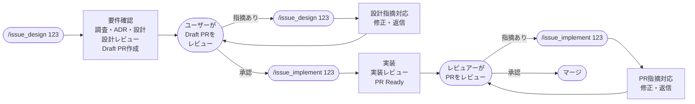

# issue_implement

Issue番号を起点に、設計を読み取り、実装・実装レビューを行い、PRをReady for Reviewにするスキル。

関連スキル: [`issue_design`](../issue_design/README.md)（IssueからDraft PRを作成する）

## パイプライン全体像



## 使い方

```
/issue_implement 123
```

Issue番号を引数に指定。`.tasks/123/` から設計情報とPR番号を読み取り、ブランチをcheckoutして実装を開始する。

前提:
- `/issue_design 123` が完了済みであること
- `.tasks/123/design.md` がユーザーレビュー済みであること（PR上で設計変更が必要な場合は、先にdesign.mdを更新する）

## 作業ディレクトリ

`issue_design` と共有する `.tasks/${issue_number}/` ディレクトリを使用する。詳細は [issue_design の作業ディレクトリ](../issue_design/README.md#作業ディレクトリ) を参照。

## アーキテクチャ方針

- **テンプレート方式**: 各フェーズの詳細指示はtemplatesのmdファイルに外部化
- **ステップ分割実装**: design.mdから実装ステップを抽出し、ステップごとにサブエージェントに委譲
- **親がテスト実行**: サブエージェントはコード変更のみ。テスト実行・結果判定は親が担当
- **gh CLIは親が実行**: サブエージェントはファイル生成のみ担当
- **異常系**: テストリトライとレビューループに上限回数を設定。超過時は状況報告+次アクション明示でスキル終了

## フロー詳細

```mermaid
flowchart TD
    Start(["/issue_implement"]) --> P0_arg{引数に\nIssue番号あり?}
    P0_arg -->|なし| P0_ask["AskUserQuestionで\nIssue番号を確認"]
    P0_ask --> P0
    P0_arg -->|あり| P0

    subgraph P0["Phase 0: 設計読み取り・レジューム判定"]
        P0_1[".tasks/N/state.md を読み取り"]
        P0_2{state.mdに\npr_number あり?}
        P0_1 --> P0_2
        P0_2 -->|なし| P0_err(["エラー: issue_designが未完了\n/issue_design 123 を先に実行"])
        P0_2 -->|あり| P0_3["gh pr view でPR情報取得\nブランチをcheckout"]
        P0_3 --> P0_conflict["ベースブランチとの\nコンフリクトチェック"]
        P0_conflict --> P0_conflict_check{コンフリクト\nあり?}
        P0_conflict_check -->|あり| P0_conflict_err(["コンフリクトの詳細をログ出力\n手動でrebase/merge解決後に再実行"])
        P0_conflict_check -->|なし| P0_4[".tasks/N/design.md を読み取り"]
        P0_4 --> P0_5{design.md\n存在?}
        P0_5 -->|なし| P0_err2(["エラー: design.mdがありません\n/issue_design 123 を再実行"])
        P0_5 -->|あり| P0_6{state.mdの\nphase?}
        P0_6 -->|draft_pr_created| P0_out["Phase 1へ"]
        P0_6 -->|plan_done| P0_resume_check{completed_steps\nあり?}
        P0_resume_check -->|なし| P0_resume["Phase 2 Step 1から"]
        P0_resume_check -->|あり| P0_resume_ask["AskUserQuestionで\n次ステップの修正状況を確認"]
        P0_resume_ask --> P0_resume_r{修正済み?}
        P0_resume_r -->|はい| P0_resume_skip["completed_stepsに追加\n次ステップからPhase 2へ"]
        P0_resume_r -->|いいえ| P0_resume_retry["当該ステップから\nPhase 2へ"]
        P0_6 -->|implementation_done\n/ review_in_progress| P0_review["Phase 3へ"]
        P0_6 -->|pr_ready\n/ feedback_in_progress| P0_pr["PR未対応コメント\nを取得"]
        P0_pr --> P0_pr_check{未対応\n指摘あり?}
        P0_pr_check -->|あり| P0_feedback["Phase 5へ"]
        P0_pr_check -->|なし| P0_done(["完了\n次: PR #N をマージ"])
    end

    P0_out --> P1
    P0_resume --> P2
    P0_resume_skip --> P2
    P0_resume_retry --> P2
    P0_review --> P3
    P0_feedback --> P5

    subgraph P1["Phase 1: 実装ステップ計画"]
        P1_1["design.mdから\n実装ステップを抽出"]
        P1_2["ステップごとの\n変更ファイル・依存関係を整理"]
        P1_3[".tasks/123/implementation-plan.md\n生成"]
        P1_4["state.md更新\n(phase: plan_done)"]
        P1_1 --> P1_2 --> P1_3 --> P1_4
    end

    P1_4 --> P2

    subgraph P2["Phase 2: 実装"]
        P2_1["Step N: サブエージェントに\n実装を委譲"]
        P2_1a["親がlint/format実行\n(auto-fix適用)"]
        P2_1b{lint/format\n通過?}
        P2_1 --> P2_1a --> P2_1b
        P2_1b -->|修正不能エラー| P2_lint_cnt{リトライ\n上限(2回)?}
        P2_lint_cnt -->|上限内| P2_4["失敗情報を渡して\nサブエージェントで修正"]
        P2_lint_cnt -->|超過| P2_exit
        P2_1b -->|通過| P2_2["親がテスト実行\n(既存+新規)"]
        P2_2 --> P2_3{テスト通過?}
        P2_3 -->|失敗| P2_design{設計自体の\n問題?}
        P2_design -->|はい| P2_design_exit
        P2_design -->|いいえ| P2_test_cnt{リトライ\n上限(2回)?}
        P2_test_cnt -->|上限内| P2_4
        P2_4 --> P2_1a
        P2_test_cnt -->|超過| P2_exit
        P2_3 -->|成功| P2_5["コミット"]
        P2_5 --> P2_5a["state.md更新\n(completed_steps に追加)"]
        P2_5a --> P2_6{次ステップ\nあり?}
        P2_6 -->|あり| P2_1
        P2_6 -->|なし| P2_7["git push"]
        P2_7 --> P2_8["state.md更新\n(phase: implementation_done)"]
        P2_8 --> P2_out["全ステップ完了"]
    end

    P2_design_exit(["スキル終了\n次: 設計の問題点をログ出力\n/issue_design 123 で設計修正後に再実行"])
    P2_exit(["スキル終了\n次: テスト失敗の詳細をログ出力\n修正完了時はstate.mdの\ncompleted_stepsに追加後\n/issue_implement 123 で再実行"])

    P2_out --> P3

    subgraph P3["Phase 3: サブエージェント実装レビュー"]
        P3_0["state.md更新\n(phase: review_in_progress)"]
        P3_0 --> P3_1
        P3_1["実装レビューエージェント\nを並列実行"]
        P3_2["レビュー結果を統合"]
        P3_3{重大な指摘\nあり?}
        P3_1 --> P3_2 --> P3_3
        P3_3 -->|あり| P3_design{設計自体の\n問題?}
        P3_design -->|はい| P3_design_exit
        P3_design -->|いいえ| P3_cnt{ループ\n上限(3回)?}
        P3_cnt -->|上限内| P3_4["実装を修正"]
        P3_4 --> P3_lint["lint/format実行"]
        P3_lint --> P3_test["テスト実行"]
        P3_test --> P3_test_ok{通過?}
        P3_test_ok -->|失敗| P3_test_cnt{リトライ\n上限(2回)?}
        P3_test_cnt -->|上限内| P3_4
        P3_test_cnt -->|超過| P3_exit
        P3_test_ok -->|成功| P3_commit["コミット"]
        P3_commit --> P3_1
        P3_cnt -->|超過| P3_exit
        P3_3 -->|なし| P3_out["レビュー完了"]
    end

    P3_design_exit(["スキル終了\n次: 設計の問題点をログ出力\n/issue_design 123 で設計修正後に再実行"])
    P3_exit(["スキル終了\n次: レビュー指摘/テスト失敗の\n詳細をログ出力\n手動修正後に再実行"])

    P3_out --> P4

    subgraph P4["Phase 4: PR更新"]
        P4_1["git push"]
        P4_2["gh pr ready\n(Ready for Reviewに変更)"]
        P4_3["PR descriptionに\n実装セクションを追記\n(テンプレートに従う)"]
        P4_4["PRコメントに\nレビュー依頼を投稿"]
        P4_5["state.md更新\n(phase: pr_ready)"]
        P4_1 --> P4_2 --> P4_3 --> P4_4 --> P4_5
    end

    P4 --> End(["スキル終了\n次: PR #N をレビューしてマージ"])

    subgraph P5["Phase 5: PR指摘対応"]
        P5_0["state.md更新\n(phase: feedback_in_progress)"]
        P5_1["全未対応コメントを\n一括分析"]
        P5_2["各指摘の要否を判断\n+ 修正計画を作成"]
        P5_3["修正不要分:\nPRコメントに理由を返信"]
        P5_4{修正要の\n指摘あり?}
        P5_0 --> P5_1 --> P5_2 --> P5_3 --> P5_4
        P5_4 -->|なし| P5_done["state.md更新\n(phase: pr_ready)"]
        P5_4 -->|あり| P5_5["修正を一括実装"]
        P5_5 --> P5_5a["lint/format実行"]
        P5_5a --> P5_6["テスト実行"]
        P5_6 --> P5_7{テスト\n通過?}
        P5_7 -->|失敗| P5_cnt{リトライ\n上限(2回)?}
        P5_cnt -->|上限内| P5_8["失敗情報をもとに再修正"]
        P5_8 --> P5_6
        P5_cnt -->|超過| P5_exit
        P5_7 -->|成功| P5_9["コミット + git push"]
        P5_9 --> P5_10["PRコメントに\n修正内容を返信"]
        P5_10 --> P5_done
    end

    P5_exit(["スキル終了\n次: テスト失敗の詳細をログ出力\n手動修正後に /issue_implement 123 で再実行"])
    P5_done --> P5_end(["スキル終了\n次: PR #N をレビューしてマージ\nまたは追加指摘後に再実行"])
```

## フェーズ詳細

| Phase | 名称 | 入力 | 出力 | 委譲方式 |
|-------|------|------|------|----------|
| 0 | 設計読み取り・レジューム | Issue番号 | design.md + PR情報 | 親が直接実行（gh CLI + Read） |
| 1 | 実装ステップ計画 | design.md | .tasks/123/implementation-plan.md | Taskツール + テンプレート |
| 2 | 実装 | plan + design.md | 実装コード + テスト通過 | ステップごとにTaskツール、親がテスト実行 |
| 3 | 実装レビュー | 実装差分 | レビュー済み実装 | 実装レビューエージェント並列 |
| 4 | PR更新 | レビュー済み実装 | Ready PR + レビュー依頼コメント | 親が直接実行（gh CLI） |
| 5 | PR指摘対応 | PRレビューコメント | 修正済み実装 + PRコメント返信 | 親が分析・gh CLI、Taskツールで修正 |

## 実装レビュー観点（Phase 3）

- **コード品質**: 命名、構造、エラーハンドリング
- **テスト**: カバレッジ、エッジケース、既存テストとの整合
- **セキュリティ**: OWASP Top 10
- **設計適合性**: design.mdとの乖離

## レジューム判定（Phase 0）

`.tasks/${issue_number}/` 内の `state.md` でフェーズを判定する。

| state.mdの状態 | 意味 | 再開先 |
|----------------|------|--------|
| `pr_number` なし | issue_design未完了 | エラー終了 |
| `phase: draft_pr_created` | 設計完了・実装未着手 | Phase 1から開始 |
| `phase: plan_done` + `completed_steps` なし | 実装計画済み | Phase 2 Step 1から |
| `phase: plan_done` + `completed_steps` あり | 実装途中 | Phase 2（未完了ステップから） |
| `phase: implementation_done` | 実装完了・レビュー未着手 | Phase 3から開始 |
| `phase: review_in_progress` | レビュー途中 | Phase 3から開始 |
| `phase: pr_ready` | PR Ready済み | PR未対応コメント確認 → あればPhase 5、なければ完了通知 |
| `phase: feedback_in_progress` | PR指摘対応途中 | Phase 5から再開 |

## 異常系設計

| 状況 | 上限 | 動作 |
|------|------|------|
| state.md不在 / pr_numberなし | - | issue_designの実行を案内。スキル終了 |
| design.md不在 | - | issue_designの再実行を案内。スキル終了 |
| 実装中に設計の問題を検出 | - | 設計の問題点をログ出力。スキル終了。`/issue_design` での設計修正を案内 |
| テスト失敗リトライ | 2回/ステップ | 失敗テスト名と出力をログ。スキル終了。再実行時にAskUserQuestionで修正状況を確認（下記「手動修正後のレジューム」参照） |
| 実装レビューで設計の問題を検出 | - | 設計の問題点をログ出力。スキル終了。`/issue_design` での設計修正を案内 |
| 実装レビューループ | 3回 | レビュー指摘の詳細をログ出力。スキル終了。次アクション明示 |
| レビュー修正後テスト失敗 | 2回 | テスト失敗の詳細をログ出力。スキル終了。次アクション明示 |
| PR指摘対応テスト失敗 | 2回 | 失敗テスト名と出力をログ。スキル終了。次アクション明示 |
| ベースブランチとのコンフリクト | - | コンフリクトの詳細をログ出力。ユーザーが手動でrebase/merge解決後に再実行 |

### 手動修正後のレジューム

Phase 2でテスト失敗によりスキル終了した場合、手動修正後に `/issue_implement` を再実行する。再実行時にスキルがAskUserQuestionで修正状況を確認する:

- **修正済みと回答**: スキルが `completed_steps` を自動更新し、次ステップから再開
- **未修正と回答**: 当該ステップから再開。サブエージェントが現在のコードをベースに実装を試みる

### 実装計画の変更

実装中にステップの追加・削除・順番変更が必要になった場合は、`implementation-plan.md` を手動で更新してから `/issue_implement` を再実行する。`state.md` の `completed_steps` は変更後のステップ番号体系と整合させること（番号がずれた場合は `completed_steps` をクリアして最初から再実行するのが安全）。

## スキル入力: .tasks/${issue_number}/ から読み取る情報

| 情報 | 取得元 |
|------|--------|
| 設計ドキュメント | `.tasks/${issue_number}/design.md` |
| PR番号 | `.tasks/${issue_number}/state.md` の `pr_number` |
| ブランチ名 | `.tasks/${issue_number}/state.md` の `branch` |
| ADR参照 | design.md内のADR参照 + `docs/adr/` ファイル |
| Issue番号 | 引数で指定 |

## スキル出力→Ready PRの構成

| 出力先 | 内容 |
|--------|------|
| PR description（追記） | 下記「実装セクション」テンプレートに従い、Draft PR descriptionの末尾に追記 |
| PRコメント | 下記「レビュー依頼コメント」テンプレートに従い投稿 |
| ブランチ上のファイル | 実装コード + テスト |
| `.tasks/123/` | `implementation-plan.md`, `state.md` 更新（ローカル作業用、コミット対象外） |

### PR description 追記テンプレート（実装セクション）

Draft PR description（issue_designが生成）の末尾に以下を追記する。既存の設計セクションは変更しない。

```markdown
<!-- ▼ issue_implement Phase 4 で追記 ▼ -->

## 実装サマリ

### 変更ファイル概要

<!-- 変更ファイルを機能単位でグルーピング。git diffの統計から生成 -->

| グループ | 主な変更ファイル | 変更内容 |
|----------|-----------------|----------|
| {機能A} | `src/foo.ts`, `src/bar.ts` | {何をした} |
| {テスト} | `tests/foo.test.ts` | {テスト追加/修正内容} |

### 設計からの差分

<!-- 実装時に設計から変更した点。なければ「設計通り実装」 -->

- なし（設計通り実装）

## レビューガイド（実装）

- **重点レビュー箇所**: {リスクが高い/複雑なロジック。ファイルパス+行範囲}
- **セルフレビュー済み**: {自動レビュー(Phase 3)で検出・修正した項目の要約}
- **テスト結果**: 全テスト通過（既存 N件 + 新規 M件）
```

**テンプレート運用ルール**:
- 「設計からの差分」は必須。差分がない場合も「設計通り実装」と明記する
- 「重点レビュー箇所」にはファイルパスと行範囲を含め、レビュアーが即座にジャンプできるようにする
- Phase 3の自動レビューで修正した内容を「セルフレビュー済み」に記載し、レビュアーの重複チェックを防ぐ

### レビュー依頼コメント テンプレート

PR Ready化と同時に、PRコメントとして投稿する。PR descriptionは長くなるため、レビュアーへの「今すぐ読んでほしい要点」を別コメントで渡す。

```markdown
## レビュー依頼

### この PR について

{1-2文で変更の目的を端的に説明}

### レビュー時の注目ポイント

1. **{観点1}**: `{ファイルパス}` — {何が重要か}
2. **{観点2}**: `{ファイルパス}` — {何が重要か}

### 変更規模

- 変更ファイル数: N files
- 追加/削除: +X / -Y lines

### 確認済み事項

- [x] 既存テスト全通過
- [x] 新規テスト追加済み
- [x] lint/format通過
- [x] セルフレビュー（セキュリティ・パフォーマンス・一貫性・コード品質）実施済み
```

**テンプレート運用ルール**:
- 「注目ポイント」は2-3個に絞る。全ファイルを列挙しない
- 「変更規模」は `git diff --stat` から自動算出する
- 「確認済み事項」はPhase 2-3の実行結果に基づいてチェックを入れる

## ファイル構成（予定）

```
issue_implement/
├── README.md                         (本ファイル)
├── SKILL.md                          (スキル本体)
├── templates/
│   ├── phase1-plan.md                (実装ステップ計画)
│   └── phase2-implement-step.md      (1ステップの実装)
└── agents/                           (実装レビューエージェント)
    ├── correctness-code-reviewer.md
    ├── security-code-reviewer.md
    ├── performance-code-reviewer.md
    ├── maintainability-code-reviewer.md
    ├── test-code-reviewer.md
    └── design-conformance-code-reviewer.md
```

## 段階的開発計画

1. **v0.1**: Phase 0 + Phase 1 + Phase 2。設計読み取り・実装ステップ計画・ステップ実装
2. **v0.2**: Phase 3 + Phase 4を追加。実装レビューエージェント+PR Ready化
3. **v0.3**: Phase 5を追加。PR指摘対応の自動化でフル機能
