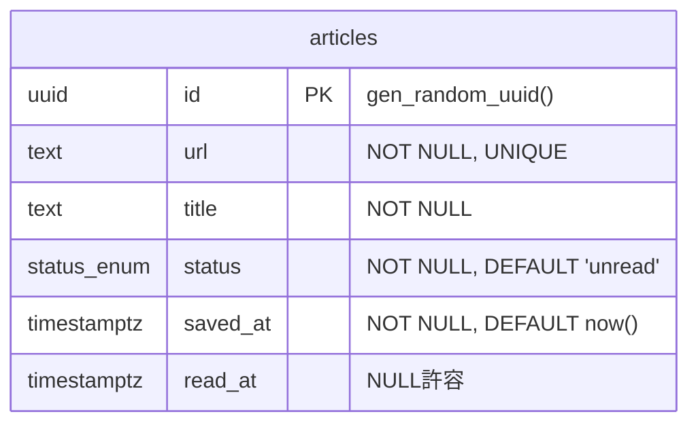

# クロスデバイス対応リーディングリスト管理ツール: 詳細設計書

## ステータス

Confirmed

## 日付

2026-02-28

## 入力文書

- 要件定義書: `docs/project-definition/requirements.md` (2026-02-19)
- アーキテクチャ設計書: `docs/project-definition/architecture.md` (2026-02-26)
- 開発規約書: `docs/project-definition/standards.md` (2026-02-27)
- 開発プロセス設計書: `docs/project-definition/development-process.md` (2026-02-27)

---

## 1. データベース設計

### 1.1 エンティティ関連図

MVPスコープではシングルテーブル構成。テーブル間リレーションなし。



### 1.2 テーブル定義

#### articles

| カラム | 型 | 制約 | デフォルト | 導出元 |
|--------|------|------|----------|--------|
| `id` | `uuid` | PRIMARY KEY | `gen_random_uuid()` | architecture.md §6.2 |
| `url` | `text` | NOT NULL, UNIQUE | — | architecture.md §6.2, SR-010 |
| `title` | `text` | NOT NULL | — | SR-001, SR-002 |
| `status` | `status`（ENUM: `'unread'`, `'read'`） | NOT NULL | `'unread'` | architecture.md §6.2, SR-004, SR-006, SR-007 |
| `saved_at` | `timestamptz` | NOT NULL | `now()` | SR-003, architecture.md §6.2 |
| `read_at` | `timestamptz` | NULL許容 | `NULL` | architecture.md §6.1 |

**Drizzle ORM スキーマ定義**（`src/lib/db/schema.ts`）:

```typescript
import { pgEnum, pgTable, text, timestamp, uuid, index } from 'drizzle-orm/pg-core';

export const statusEnum = pgEnum('status', ['unread', 'read']);

export const articles = pgTable('articles', {
  id: uuid('id').defaultRandom().primaryKey(),
  url: text('url').notNull().unique(),
  title: text('title').notNull(),
  status: statusEnum('status').notNull().default('unread'),
  savedAt: timestamp('saved_at', { withTimezone: true }).notNull().defaultNow(),
  readAt: timestamp('read_at', { withTimezone: true }),
}, (table) => [
  index('idx_articles_status_saved_at').on(table.status, table.savedAt),
]);
```

TypeScript側: camelCase（`savedAt`, `readAt`）、DB側: snake_case（`saved_at`, `read_at`）。

### 1.3 Enum 定義

| 名前 | 値 | 導出元 |
|------|------|--------|
| `status` | `'unread'`, `'read'` | SR-004, SR-006, SR-007, architecture.md §6.2 |

| Enum値 | 説明 | 備考 |
|--------|------|------|
| `'unread'` | 保存直後のデフォルト状態。未読一覧に表示 | 初期値 |
| `'read'` | 既読操作後の状態。未読一覧から除外 | 既読化操作で遷移 |

### 1.4 インデックス定義

| 名前 | テーブル | カラム | 種別 | 導出元 |
|------|---------|--------|------|--------|
| `articles_url_key`（自動生成） | `articles` | `url` | B-Tree UNIQUE | SR-010, architecture.md §6.2 |
| `idx_articles_status_saved_at` | `articles` | `(status, saved_at)` | B-Tree 複合 | SR-004, SR-018, architecture.md §6.2 |

**検索インデックスについて**: SR-009 のキーワード検索は LIKE 部分一致（`%keyword%`）によるシーケンシャルスキャン。想定データ上限5,000件で10ms以下と見込む（NFR-3 検索3秒以内を十分満たす）。5,000件超または応答1秒超の場合は `pg_trgm` 拡張（GINインデックス）の導入を判断する。

### 1.5 マイグレーション計画

| # | ファイル名 | 内容 |
|---|----------|------|
| 1 | `0001_create_status_enum_and_articles_table.sql` | `status` ENUM型生成 + `articles` テーブル作成 + `idx_articles_status_saved_at` 複合インデックス作成 |

**実行順序**:
1. `src/lib/db/schema.ts` を変更する
2. `pnpm drizzle-kit generate` → マイグレーション SQL を生成する
3. 生成された SQL を目視確認する
4. 開発 DB で `pnpm drizzle-kit migrate` → 動作確認する
5. 本番 DB で `pnpm drizzle-kit migrate` を先行実行する
6. `git push origin main` → Netlify 自動デプロイ

**ロールバック手順**: マイグレーション失敗時は以下の SQL を手動実行する:
```sql
DROP TABLE IF EXISTS articles;
DROP TYPE IF EXISTS status;
```

---

## 2. サービス層設計

### 2.1 ArticleService

ファイル: `src/lib/services/article-service.ts`

#### メソッド一覧

| メソッド | 引数 | 戻り値 | エラーケース | 関連SR |
|---------|------|--------|------------|--------|
| `save(url: string)` | バリデーション済みURL文字列 | `Promise<SaveResult>` | `AppError('duplicate')`: 重複URL / `AppError('system')`: DB障害。タイトル取得失敗は内部処理でフォールバック（SaveResult.titleFetchFailed=true） | SR-001, SR-002, SR-010, SR-015 |
| `getUnreadArticles()` | なし | `Promise<Article[]>` | `AppError('system')`: DB障害 | SR-004 |
| `getReadArticles()` | なし | `Promise<Article[]>` | `AppError('system')`: DB障害 | SR-018 |
| `getUnreadCount()` | なし | `Promise<number>` | `AppError('system')`: DB障害 | SR-011, SR-012 |
| `markAsRead(id: string)` | 記事UUID | `Promise<void>` | `AppError('system')`: DB障害 | SR-006 |
| `markAsUnread(id: string)` | 記事UUID | `Promise<void>` | `AppError('system')`: DB障害 | SR-007 |
| `deleteArticle(id: string)` | 記事UUID | `Promise<void>` | `AppError('system')`: DB障害 | SR-008 |
| `search(keyword: string)` | 検索キーワード文字列 | `Promise<Article[]>` | `AppError('system')`: DB障害 | SR-009 |

#### ビジネスルール

| ルール | 条件 | アクション | 導出元 |
|--------|------|----------|--------|
| 重複URL検出（アプリ層） | `findByUrl(url)` が結果を返す | `AppError({ kind: 'duplicate', message: 'この URL は既に保存されています' })` を throw し保存中止 | SR-010, architecture.md §9.1 |
| 重複URL検出（DB層） | PostgreSQL エラーコード `23505`（unique_violation）発生 | ArticleRepository が `AppError({ kind: 'duplicate', message: 'この URL は既に保存されています' })` に変換して throw | SR-010, architecture.md §9.1 |
| タイトル取得失敗フォールバック | TitleFetcher が throw する（タイムアウト3秒超過またはHTTPエラー） | URLをタイトル代替として保存を続行。`SaveResult.titleFetchFailed = true` を返却 | SR-015, architecture.md §5.1 |
| 未読蓄積警告 | `getUnreadCount()` の返却値 > 20 | Serviceは件数を返却するのみ。Handler層（ArticleListPage）で `unreadCount > 20` を判定し警告メッセージを表示する | SR-013 |
| 既読化時 read_at 設定 | `markAsRead(id)` 呼び出し時 | `read_at = now()` を同時に更新 | SR-006 |
| 未読戻し時 read_at クリア | `markAsUnread(id)` 呼び出し時 | `read_at = NULL` を同時に更新 | SR-007 |

**save メソッド処理フロー**（詳細）:
```
1. this.#checkDuplicate(url) → findByUrl で SELECT。結果あれば throw AppError('duplicate')
2. try { title = await this.titleFetcher.fetch(url) }
   catch { title = url; titleFetchFailed = true }
3. article = await this.repository.create(url, title)
   ※ 23505 エラーは Repository 内で AppError('duplicate') に変換して throw
4. return { article, titleFetchFailed }
```

#### トランザクション境界

| 操作 | スコープ | 分離レベル | 理由 |
|------|---------|----------|------|
| 全操作 | 単一SQL文 | PostgreSQL デフォルト（READ COMMITTED） | シンプルCRUD・シングルユーザー構成で明示的トランザクション不要。UNIQUE制約で最終保証 |

明示的トランザクション・ロックは使用しない。並行リクエスト時の重複保存は DB の UNIQUE 制約で最終保証する（standards.md §5.4）。

### 2.2 TitleFetcher

ファイル: `src/lib/services/title-fetcher.ts`

#### メソッド一覧

| メソッド | 引数 | 戻り値 | エラーケース | 関連SR |
|---------|------|--------|------------|--------|
| `fetch(url: string)` | 記事URL文字列 | `Promise<string>`（記事タイトル） | `AppError('title_fetch_failed')`: タイムアウト（3秒）、HTTPエラー、SSRF拒否 | SR-001, SR-002, SR-015 |

**SSRF対策**（TitleFetcher内部で実施。Handler層での追加フィルタリングは不要）:
- URLのホスト部分を解決し、以下のプライベートIPアドレス範囲へのリクエストを拒否する:
  - RFC1918プライベートアドレス: `10.0.0.0/8`, `172.16.0.0/12`, `192.168.0.0/16`
  - ループバック: `127.0.0.0/8`
  - リンクローカル: `169.254.0.0/16`
- 許可プロトコルをHTTPSのみに制限する（httpは拒否）
- HTTPリダイレクト追跡時はリダイレクト先URLにも同様フィルタリングを適用する（または `redirect: 'manual'` でリダイレクト追跡を無効化）

**タイムアウト実装パターン**（3秒）:
```typescript
const controller = new AbortController();
const timeoutId = setTimeout(() => controller.abort(), 3000);
try {
  const response = await fetch(url, { signal: controller.signal });
  // ...
} finally {
  clearTimeout(timeoutId);
}
```

### 2.3 DI インターフェース定義

**IArticleRepository**（`src/lib/interfaces/article-repository.interface.ts`）:

```typescript
interface IArticleRepository {
  create(url: string, title: string): Promise<Article>;
  findByUrl(url: string): Promise<Article | null>;
  findByStatus(status: 'unread' | 'read'): Promise<Article[]>;
  countByStatus(status: 'unread'): Promise<number>;
  updateStatus(id: string, status: 'unread' | 'read', readAt: Date | null): Promise<void>;
  deleteById(id: string): Promise<void>;
  search(keyword: string): Promise<Article[]>;
}
```

**ITitleFetcher**（`src/lib/interfaces/title-fetcher.interface.ts`）:

```typescript
interface ITitleFetcher {
  fetch(url: string): Promise<string>;
}
```

DI方式: コンストラクタ注入に統一。ArticleService はコンストラクタで `IArticleRepository` と `ITitleFetcher` を受け取る（architecture.md §5.3）。

### 2.4 ファクトリ関数

| ファクトリ | 生成対象 | 依存 | 使用箇所 |
|-----------|---------|------|---------|
| `createArticleService()` | `ArticleService` インスタンス | `ArticleRepository(db)`, `TitleFetcher()` | Server Actions, Route Handlers（Handler層全般） |

```typescript
// src/lib/services/article-service.ts
export function createArticleService(): ArticleService {
  const repository = new ArticleRepository(db);
  const titleFetcher = new TitleFetcher();
  return new ArticleService(repository, titleFetcher);
}
```

---

## 3. API インターフェース設計

### 3.1 Server Action

全 Server Action の共通処理フロー:
1. セッション検証（Auth.js）
2. Zod バリデーション（失敗時 `ActionResult<never>` を return）
3. try-catch でサービスメソッドを呼び出す
4. `ActionResult<T>` を return
5. 書き込み操作は `revalidatePath('/')` と `revalidatePath('/search')` の両パスを実行する

#### saveArticle

- トリガー元: `ArticleSaveForm`
- 入力スキーマ: `articleUrlSchema`（`z.string().min(1, 'URLを入力してください').url('URLの形式が正しくありません')`）
- 出力型: `ActionResult<SaveResult>`
- 認証: 必要（セッション検証）
- エラーレスポンス:
  - `duplicate`: `{ success: false, error: 'この URL は既に保存されています' }`
  - `title_fetch_failed`: `{ success: true, data: { article, titleFetchFailed: true } }`（保存は成功。Handler層でインライン通知「タイトルを取得できませんでした（URLで保存しました）」を表示）
  - `system`: `{ success: false, error: '保存に失敗しました' }`
- 関連SR: SR-001, SR-010, SR-014, SR-015, SR-016

#### markAsRead

- トリガー元: `ArticleCardActions`
- 入力スキーマ: `articleIdSchema`（`z.string().uuid('無効な記事IDです')`）
- 出力型: `ActionResult`（`ActionResult<void>`）
- 認証: 必要（セッション検証）
- エラーレスポンス:
  - `system`: `{ success: false, error: '操作に失敗しました' }`
- 関連SR: SR-006

#### markAsUnread

- トリガー元: `ArticleCardActions`
- 入力スキーマ: `articleIdSchema`（`z.string().uuid('無効な記事IDです')`）
- 出力型: `ActionResult`（`ActionResult<void>`）
- 認証: 必要（セッション検証）
- エラーレスポンス:
  - `system`: `{ success: false, error: '操作に失敗しました' }`
- 関連SR: SR-007

#### deleteArticle

- トリガー元: `ArticleCardActions`
- 入力スキーマ: `articleIdSchema`（`z.string().uuid('無効な記事IDです')`）
- 出力型: `ActionResult`（`ActionResult<void>`）
- 認証: 必要（セッション検証）
- エラーレスポンス:
  - `system`: `{ success: false, error: '削除に失敗しました' }`
- 関連SR: SR-008

#### searchArticles

- トリガー元: `SearchPage`
- 入力スキーマ: `searchKeywordSchema`（`z.string().min(1, '検索キーワードを入力してください')`）
- 出力型: `ActionResult<Article[]>`
- 認証: 必要（セッション検証）
- エラーレスポンス:
  - `system`: `{ success: false, error: '検索に失敗しました' }`
- 関連SR: SR-009

### 3.2 Route Handler

#### POST /api/share

- 目的: Android共有メニュー経由でURLを受け取り記事として保存する（Web Share Target API）
- リクエスト:
  - Content-Type: `application/x-www-form-urlencoded`
  - パラメータ: `url: string`
- レスポンス:
  - 成功: `302 Redirect → /`
  - バリデーションエラー: `302 Redirect → /?error=invalid_url`
  - 重複: `302 Redirect → /?error=duplicate`
  - CSRF拒否（Originヘッダー不一致）: `403 Forbidden`
  - 認証失敗: `302 Redirect → ログインページ`
  - システムエラー: `302 Redirect → /?error=system`
- 認証: セッション検証（必要）
- CSRF: Originヘッダー検証（`request.headers.get('origin')` を `process.env.URL`（Netlifyデプロイドメイン）と照合。不一致は403を返す）
- 処理フロー: Origin検証 → セッション検証 → Zodバリデーション（`articleUrlSchema`） → `service.save(url)` → `revalidatePath('/')` → `302 Redirect`
- 関連IR: IR-001
- 関連SR: SR-002, SR-010, SR-015

**PWA manifest.json の Web Share Target 設定**:
```json
{
  "share_target": {
    "action": "/api/share",
    "method": "POST",
    "enctype": "application/x-www-form-urlencoded",
    "params": {
      "url": "url"
    }
  }
}
```

#### GET /api/ping

- 目的: Neonコールドスタート防止のためのwarm-up ping（DB接続維持）
- リクエスト: なし（認証トークンはヘッダーで送付）
- レスポンス:
  - 成功: `200 OK` `{ "status": "ok" }`
  - 認証失敗: `401 Unauthorized`
- 認証: `Authorization: Bearer <PING_SECRET>`（Auth.js Middleware対象外）
- 関連NFR: NFR-3（architecture.md §9.5）

### 3.3 Server Component データ契約

| コンポーネント | データ入力 | ソース Service メソッド | 関連SR |
|--------------|----------|---------------------|--------|
| `ArticleListPage` | `{ articles: Article[], unreadCount: number }`（デフォルト: 未読一覧。タブ切替で既読一覧） | `getUnreadArticles()` + `getUnreadCount()` / `getReadArticles()` | SR-004, SR-005, SR-011, SR-012, SR-013, SR-018 |
| `SearchPage` | `Article[]`（Action 経由で取得） | `searchArticles` Server Action → `search(keyword)` | SR-009 |
| `ArticleCard` | `{ article: Article, onMarkAsRead, onMarkAsUnread, onDelete }`（props経由） | 上位ページコンポーネント（ArticleListPage）から受け取る | SR-003, SR-006, SR-007, SR-008 |
| `ArticleSaveForm` | props なし（フォーム入力のみ） | `saveArticle` Server Action → `save(url)` | SR-001, SR-010, SR-014, SR-015, SR-016 |

---

## 4. バッチ処理・非同期処理設計

### 4.1 ジョブ定義

| ジョブ | トリガー | 頻度 | タイムアウト | べき等 |
|-------|---------|------|-----------|--------|
| warm-up ping | Netlify Scheduled Functions（利用不可時: GitHub Actions scheduled workflow） | 5〜10分間隔 | Functionsデフォルト10秒（DB接続タイムアウト: 5秒） | yes（SELECT 1 は読み取り専用） |

### 4.2 データフロー

```
Scheduler → GET /api/ping
  → PING_SECRET 検証（Authorization: Bearer <PING_SECRET>）
  → SELECT 1（Neon PostgreSQL）
  → 200 OK { "status": "ok" }
```

### 4.3 リトライ設計

| ジョブ | リトライ回数 | バックオフ | デッドレター |
|-------|------------|----------|------------|
| warm-up ping | プラットフォームのデフォルト動作に委ねる | プラットフォームのデフォルト | なし（失敗時は `console.error` ログ出力のみ） |

---

## 5. 型定義・インターフェースカタログ

### 5.1 エンティティ型（§1 から合成）

```typescript
// §1.2 articles テーブル定義から導出
// ファイル: src/lib/types.ts（または src/lib/db/schema.ts からの型エクスポート）

type Article = {
  id: string;           // uuid
  url: string;          // text, NOT NULL, UNIQUE
  title: string;        // text, NOT NULL
  status: 'unread' | 'read'; // statusEnum, NOT NULL, DEFAULT 'unread'
  savedAt: Date;        // timestamptz, NOT NULL (DB: saved_at)
  readAt: Date | null;  // timestamptz, NULL許容 (DB: read_at)
};
```

Drizzle ORM の型推論（`InferSelectModel<typeof articles>`）から自動導出する。

### 5.2 DTO 型（§3 から合成）

```typescript
// §3.1 Server Action 入出力から導出

// saveArticle の返却型（§2.1 ServiceResultより）
type SaveResult = {
  article: Article;
  titleFetchFailed: boolean;
};

// ActionResult 汎用型（src/lib/types.ts）
type ActionResult<T = void> = { success: true; data: T } | { success: false; error: string };

// saveArticle の具体的な出力型
type SaveArticleResult = ActionResult<SaveResult>;

// searchArticles の具体的な出力型
type SearchArticlesResult = ActionResult<Article[]>;
```

### 5.3 DI インターフェース一覧（§2.2 のサマリ）

| インターフェース | ファイル | 概要 |
|----------------|---------|------|
| `IArticleRepository` | `src/lib/interfaces/article-repository.interface.ts` | articlesテーブルへのCRUD操作を抽象化。テスト時にモック実装と差し替え可能にする |
| `ITitleFetcher` | `src/lib/interfaces/title-fetcher.interface.ts` | 記事URLからタイトルを取得する処理を抽象化。テスト時にモック実装と差し替え可能にする |

### 5.4 エラー型（§2-3 から合成）

```typescript
// src/lib/errors.ts

type AppError = {
  kind: 'validation' | 'duplicate' | 'title_fetch_failed' | 'system';
  message: string;
};
```

| kind値 | 発生層 | 説明 |
|--------|--------|------|
| `'validation'` | Handler層（Zodバリデーション） | URL形式不正（SR-014）、空文字（SR-016）、UUID不正 |
| `'duplicate'` | Service層 / Repository層 | 重複URL保存（SR-010）。アプリ層SELECTまたはDB層UNIQUE制約違反（23505）から発生 |
| `'title_fetch_failed'` | Service層（TitleFetcher経由） | タイトル取得失敗（SR-015）。ArticleService内部でフォールバック処理済み。外部への throw はしない |
| `'system'` | Repository層 / TitleFetcher | DB障害等の予期しないエラー |

各層のエラー処理パターン（standards.md §2.1）:
- Handler層: `try-catch` で `AppError` を捕捉し `ActionResult` に変換して `return`。`throw` しない
- Service層: ビジネスルール違反時に `AppError` を `throw`
- Repository層: DB固有エラー（PostgreSQL `23505` 等）を捕捉し `AppError` に変換して `throw`

### 5.5 共有 Enum 型（§1.3 のサマリ）

```typescript
// Drizzle ORM の pgEnum から TypeScript 型を推論
type ArticleStatus = 'unread' | 'read';
```

| 値 | 意味 | 初期値 |
|----|------|--------|
| `'unread'` | 未読（保存直後のデフォルト状態） | yes |
| `'read'` | 既読（明示的な既読操作後） | no |

---

## 6. 状態遷移設計

### 6.1 状態定義

| エンティティ | ステータスカラム | 有効な状態 | 初期状態 |
|------------|---------------|----------|---------|
| `articles` | `status`（`statusEnum`） | `'unread'`, `'read'` | `'unread'` |

### 6.2 遷移マトリクス

| From → To | トリガー | ガード条件 | Service メソッド | API エンドポイント |
|-----------|---------|----------|----------------|-----------------|
| `unread` → `read` | ユーザーが既読操作を実行（SR-006） | なし（べき等: 既に `read` の場合も同じSQL実行で副作用なし） | `ArticleService.markAsRead(id)` → `updateStatus(id, 'read', now())` | Server Action: `markAsRead` |
| `read` → `unread` | ユーザーが未読に戻す操作を実行（SR-007） | なし（べき等: 既に `unread` の場合も同じSQL実行で副作用なし） | `ArticleService.markAsUnread(id)` → `updateStatus(id, 'unread', null)` | Server Action: `markAsUnread` |

**副作用**:
- `unread` → `read`: `read_at = now()` を同時に更新（SR-006）
- `read` → `unread`: `read_at = NULL` に更新（SR-007）

---

## 7. トレーサビリティ

### 7.1 SR → 仕様マッピング

| SR-ID | DB 仕様 | Service 仕様 | API 仕様 |
|-------|---------|------------|---------|
| SR-001 | §1.2 articles.url, articles.title, articles.saved_at | §2.1 ArticleService.save(url) | §3.1 saveArticle（ArticleSaveForm経由） |
| SR-002 | §1.2 articles.url, articles.title, articles.saved_at | §2.1 ArticleService.save(url) | §3.2 POST /api/share（WebShareTargetHandler経由） |
| SR-003 | §1.2 articles.saved_at（NOT NULL, DEFAULT now()） | — | — |
| SR-004 | §1.4 idx_articles_status_saved_at（status='unread'フィルタ用） | §2.1 ArticleService.getUnreadArticles() | §3.3 ArticleListPage（getUnreadArticles() + getUnreadCount()） |
| SR-005 | §1.2 articles テーブル（Neon PostgreSQL による共有DB） | — | — |
| SR-006 | §1.2 articles.status, articles.read_at | §2.1 ArticleService.markAsRead(id)、§2.1 ビジネスルール（read_at=now()） | §3.1 markAsRead Server Action |
| SR-007 | §1.2 articles.status, articles.read_at | §2.1 ArticleService.markAsUnread(id)、§2.1 ビジネスルール（read_at=NULL） | §3.1 markAsUnread Server Action |
| SR-008 | §1.2 articles テーブル（物理削除） | §2.1 ArticleService.deleteArticle(id) | §3.1 deleteArticle Server Action |
| SR-009 | §1.4 検索インデックス（LIKE部分一致、シーケンシャルスキャン） | §2.1 ArticleService.search(keyword) | §3.1 searchArticles Server Action |
| SR-010 | §1.2 articles.url（UNIQUE制約）、§1.4 articles_url_key | §2.1 ビジネスルール（重複URL検出: アプリ層SELECT + DB層UNIQUE制約二段構え） | §3.1 saveArticle（エラーレスポンス: 'この URL は既に保存されています'）、§3.2 POST /api/share（302 /?error=duplicate） |
| SR-011 | §1.4 idx_articles_status_saved_at | §2.1 ArticleService.getUnreadCount() | §3.3 ArticleListPage（unreadCount >= 1 で件数表示） |
| SR-012 | §1.4 idx_articles_status_saved_at | §2.1 ArticleService.getUnreadCount() | §3.3 ArticleListPage（unreadCount == 0 で0表示） |
| SR-013 | — | §2.1 ArticleService.getUnreadCount()（件数返却のみ） | §3.3 ArticleListPage（unreadCount > 20 で警告メッセージ表示） |
| SR-014 | — | — | §3.1 saveArticle（articleUrlSchema で URL形式チェック）、§3.2 POST /api/share（302 /?error=invalid_url） |
| SR-015 | — | §2.1 TitleFetcher.fetch（タイムアウト3秒）、ArticleService.save フォールバック（title=url, titleFetchFailed=true） | §3.1 saveArticle（titleFetchFailed=true 時インライン通知「タイトルを取得できませんでした（URLで保存しました）」） |
| SR-016 | — | — | §3.1 saveArticle（articleUrlSchema で min(1)空文字チェック） |
| SR-017 | §1.2 articles テーブル（Neon PostgreSQL 即時永続化）、§1.4 インデックス | — | 書き込み操作後の revalidatePath('/')・revalidatePath('/search') により次回アクセス時に最新状態を取得 |
| SR-018 | §1.4 idx_articles_status_saved_at（status='read'フィルタ用） | §2.1 ArticleService.getReadArticles() | §3.3 ArticleListPage（タブ切替で getReadArticles()） |

### 7.2 NFR 反映

| NFR-ID | 反映先仕様要素 | 対応方法 |
|--------|-------------|---------|
| NFR-1 | §1.2（Neon無料枠）、§3.2 GET /api/ping（warm-up pingでコンピュート消費を最小化） | Netlify Starter（$0）+ Neon 無料枠（$0）。月額0円運用 |
| NFR-2 | §1.5 マイグレーション計画（`pnpm drizzle-kit migrate` + `git push` 1コマンド） | main push で Netlify 自動デプロイ。マイグレーション含む場合のみ追加1ステップ |
| NFR-3 | §2.1 TitleFetcher（タイムアウト3秒）、§1.4 インデックス設計（検索性能）、§3.2 GET /api/ping（コールドスタート対策） | TitleFetcher AbortController + setTimeout(3000)。idx_articles_status_saved_at でソート高速化。warm-up pingでDB接続維持 |
| NFR-4 | §3.1 全Server Action（セッション検証）、§3.2 POST /api/share（Originヘッダー検証・セッション検証）、§3.2 GET /api/ping（PING_SECRETトークン検証） | Auth.js Middlewareで全ページ認証。ALLOWED_EMAILでシングルユーザー制限。環境変数でシークレット管理 |
| NFR-5 | §1.2 articles テーブル（Neonポイントインタイムリストア + pg_dump週次バックアップ） | RPO: 直近バックアップ時点（最大1週間）。RTO: 1日以内 |
| NFR-6 | §3.2 POST /api/share（2ステップ: Android共有→完了）、§3.1 saveArticle（3ステップ: URLコピー→フォームペースト→保存実行） | PWA Web Share Target APIでスマホ2ステップ保存。PCはArticleSaveFormで3ステップ保存 |

### 7.3 IR → API マッピング

| IR-ID | API 仕様参照 |
|-------|------------|
| IR-001 | §3.2 POST /api/share（WebShareTargetHandler: Android共有メニューからURL文字列を受け取る。application/x-www-form-urlencoded形式） |
| IR-002 | §3.1 全Server Action・§3.3 全Server Component（Tailwind CSSモバイルファーストレスポンシブ対応。スマートフォン・PCブラウザ両対応） |
| IR-003 | §3.1 全Server Action（セッション検証を冒頭で実施）、§3.2 POST /api/share（セッション検証）。Auth.js Middlewareで未認証アクセスをログインページへリダイレクト |
