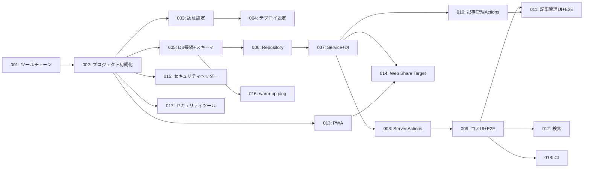

# タスクリスト: クロスデバイス対応リーディングリスト管理ツール

## ステータス

Draft

## 日付

2026-03-01

## 概要

- タスク数: 18
- 入力文書:
  - `docs/project-definition/problem-statement.md` (2026-02-17)
  - `docs/project-definition/requirements.md` (2026-02-19)
  - `docs/project-definition/architecture.md` (2026-02-26)
  - `docs/project-definition/standards.md` (2026-02-27)
  - `docs/project-definition/development-process.md` (2026-02-27)
  - `docs/project-definition/detailed-design.md` (2026-02-28)

## 依存関係グラフ

## カバレッジサマリ

| 要件種別 | カバー | 合計 |
|---------|-------|------|
| SR | 18 | 18 |
| NFR | 6 | 6 |
| IR | 3 | 3 |

## タスク一覧

| # | ファイル | タイトル | 元スライス | blocked_by |
|---|---------|---------|-----------|-----------|
| 001 | [001-toolchain-setup.md](task-list/001-toolchain-setup.md) | ツールチェーンセットアップ | ルール0 — ツールチェーン | — |
| 002 | [002-project-init.md](task-list/002-project-init.md) | Next.jsプロジェクト基盤 + ドキュメント | ルール1 — プロジェクト初期化 | 001 |
| 003 | [003-auth-config.md](task-list/003-auth-config.md) | Auth.js認証設定 | ルール1 — 認証 | 002 |
| 004 | [004-deploy-config.md](task-list/004-deploy-config.md) | Netlifyデプロイ設定 | ルール1 — デプロイ | 003 |
| 005 | [005-db-schema.md](task-list/005-db-schema.md) | DB接続 + スキーマ + マイグレーション | ルール2 — コアデータパス（DB層） | 002 |
| 006 | [006-repository.md](task-list/006-repository.md) | ArticleRepository + 統合テスト | ルール2 — コアデータパス（Repository層） | 005 |
| 007 | [007-service-di.md](task-list/007-service-di.md) | ArticleService + TitleFetcher + DI + Unitテスト | ルール2 — コアデータパス（Service層） | 006 |
| 008 | [008-server-actions-save.md](task-list/008-server-actions-save.md) | 記事保存・一覧取得 Server Actions | ルール2 — コアデータパス（Handler層） | 007 |
| 009 | [009-core-ui-e2e.md](task-list/009-core-ui-e2e.md) | ArticleSaveForm + ArticleListPage + ArticleCard UI + E2Eテスト | ルール2 — コアデータパス（UI層） | 008 |
| 010 | [010-article-mgmt-actions.md](task-list/010-article-mgmt-actions.md) | 既読化・未読戻し・削除 Server Actions + 既読一覧取得 | ルール3 — 記事状態管理（Backend） | 007 |
| 011 | [011-article-mgmt-ui.md](task-list/011-article-mgmt-ui.md) | ArticleCardActions UI + 既読一覧タブ + E2Eテスト | ルール3 — 記事状態管理（Frontend） | 009, 010 |
| 012 | [012-search.md](task-list/012-search.md) | searchArticles Server Action + SearchPage + E2Eテスト | ルール3 — 検索機能 | 009 |
| 013 | [013-pwa.md](task-list/013-pwa.md) | PWA manifest + Service Worker | ルール4 — PWA基盤 | 002 |
| 014 | [014-web-share-target.md](task-list/014-web-share-target.md) | Web Share Target Route Handler + テスト | ルール4 — Web Share Target | 007, 013 |
| 015 | [015-security-headers.md](task-list/015-security-headers.md) | HTTPセキュリティヘッダー + Error Boundary | ルール4 — セキュリティ | 002 |
| 016 | [016-warmup-ping.md](task-list/016-warmup-ping.md) | warm-up pingエンドポイント + テスト | ルール4 — コールドスタート対策 | 005 |
| 017 | [017-security-tools.md](task-list/017-security-tools.md) | gitleaks + lefthook + Dependabot + pg_dumpバックアップ手順 | ルール4 — セキュリティツール | 002 |
| 018 | [018-ci-pipeline.md](task-list/018-ci-pipeline.md) | GitHub Actions CIパイプライン | CI/CD | 009 |
